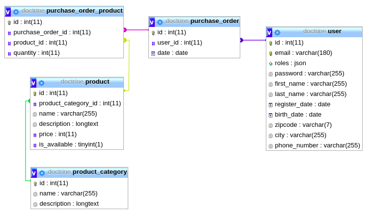

# Doctrine by example

* Install the application:

 `php bin/console app:install`

* Database schema



* Entities

    ```
    User
    PurchaseOrder
    Product
    ProductCategory
    ```


* Examples:

    * Using repositories: `App\Controller\RepositoryController` [File](./src/Controller/RepositoryController.php)
    * Using Query Builder: `App\Controller\QueryBuilderController`[File](./src/Controller/QueryBuilderController.php)


## Examples

    ```
      ROUTE NAME                          URL                                          
      ----------                          -------------------                          
      qb_like                             /query-builder/like                          
      qb_order_by                         /query-builder/order-by                      
      qb_limit                            /query-builder/limit                         
      qb_max                              /query-builder/max                           
      qb_having                           /query-builder/having                        
      qb_inner_join                       /query-builder/inner-join                    
      qb_inner_join_with_group_by         /query-builder/inner-join-with-group-by      
      qb_left_join                        /query-builder/left-join                     
      qb_not_exists                       /query-builder/not-exists                    
      qb_exists                           /query-builder/exists                        
      qb                                  /repository/                                 
      qb_find_one                         /repository/find-one/{id}                    
      qb_find_all                         /repository/find-all                         
      qb_find_one_by                      /repository/find-one-by/{attribute}/{value}  
      qb_find_by                          /repository/find-by/{attribute}/{value}      
      repository_count_result             /repository/count-result                     
      random_select                       /random-select                               
      random_select_serialized            /random-select-serialized   
      random_select_auto_serialized       /random-select-auto-serialized               
    ```

## Symfony commands:

* `composer create-project symfony/website-skeleton doctrine`

* `php bin/console doctrine:database:create`

* `php bin/console make:entity EntityName`

* `php bin/console make:migration`

* `php bin/console doctrine:migrations:migrate`

* `composer require orm-fixtures --dev`

* `composer require fzaninotto/faker`

* `php bin/console make:fixture User`
  
  * Fixture dependencies [read more](https://symfony.com/doc/master/bundles/DoctrineFixturesBundle/index.html)
  
    ``` 
    namespace App\DataFixtures;
    // ...
    use App\DataFixtures\UserFixtures;
    use Doctrine\Common\DataFixtures\DependentFixtureInterface;
    
    class GroupFixtures extends Fixture implements DependentFixtureInterface
    {
        // .....
        
        public function getDependencies()
        {
            return [
                UserFixtures::class,
            ];
        }
    }
    ```

* Make generic repository `BaseRepository` 
    * Read this: https://stackoverflow.com/questions/53747651/how-to-make-a-generic-repository-in-symfony-4
        - 1 - First way: make `BaseRepository` an `abstract class`
        - 2 - Second way: Inside `services.yaml`: prevent symfony from reading the file as a service! 
        ```
            # makes classes in src/ available to be used as services
            # this creates a service per class whose id is the fully-qualified class name
            App\:
                resource: '../src/*'
                exclude: '../src/{DependencyInjection,Entity,Migrations,Tests,Kernel.php,Repository/BaseRepository.php}'
        ```
    
    
* Install the `serializer-pack`:

  `composer require symfony/serializer-pack`
  
  * Use normalizer to transform objects to arrays
    * https://www.youtube.com/watch?v=SG7GgcnR1F4

  * Check different ways of transforming object to readable json inside TestController
    * `return $this->json($randomProducts, 200, [], ['groups' => 'products:read']);`
    * `NormalizerInterface $normalizer`
    * `SerializerInterface $serializer`
